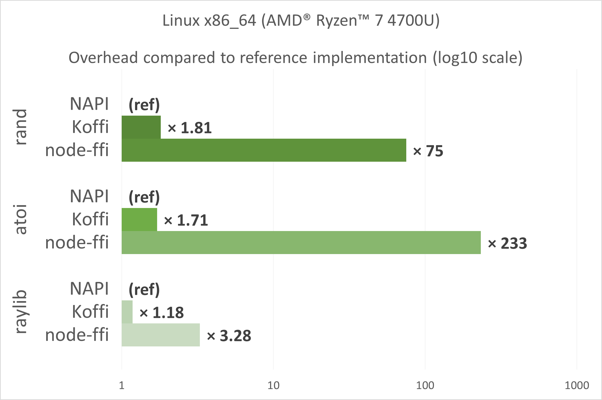
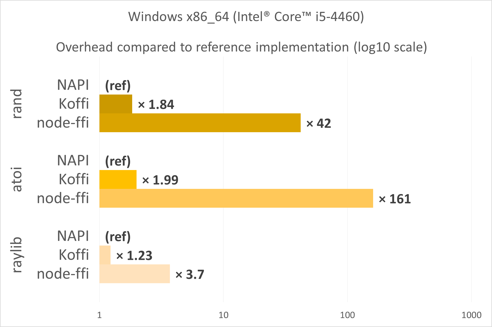

# Benchmarks

Here is a quick overview of the execution time of Koffi calls on three test cases (one based around rand, one based on atoi and one based on Raylib) compared to theoretical ideal implementations.

<table style="margin: 0 auto;">
    <tr>
        <td><a href="_static/perf_linux_20220623.png" target="_blank"></a></td>
        <td><a href="_static/perf_windows_20220623.png" target="_blank"></a></td>
    </tr>
</table>

These results are detailed and explained below, and compared to node-ffi/node-ffi-napi.

## rand results

This test is based around repeated calls to a simple standard C function atoi, and has three implementations:

- the first one is the reference, it calls atoi through an N-API module, and is close to the theoretical limit of a perfect (no overhead) Node.js > C FFI implementation.
- the second one calls atoi through Koffi
- the third one uses the official Node.js FFI implementation, node-ffi-napi

Because rand is a pretty small function, the FFI overhead is clearly visible.

### Linux x86_64

The results below were measured on my x86_64 Linux machine (AMD® Ryzen™ 7 4700U):

Benchmark     | Iterations | Total time  | Overhead
------------- | ---------- | ----------- | ----------
rand_napi     | 20000000   | 1.44s       | (baseline)
rand_koffi    | 20000000   | 2.60s       | x1.81
rand_node_ffi | 20000000   | 107.58s     | x75

### Windows x86_64

The results below were measured on my x86_64 Windows machine (Intel® Core™ i5-4460):

Benchmark     | Iterations | Total time  | Overhead
------------- | ---------- | ----------- | ----------
rand_napi     | 20000000   | 2.10s       | (baseline)
rand_koffi    | 20000000   | 3.87s       | x1.84
rand_node_ffi | 20000000   | 87.84s      | x42

## atoi results

This test is similar to the rand one, but it is based on atoi, which takes a string parameter. Javascript (V8) to C string conversion is relatively slow and heavy.

Because rand is a pretty small function, the FFI overhead is clearly visible.

### Linux x86_64

The results below were measured on my x86_64 Linux machine (AMD® Ryzen™ 7 4700U):

Benchmark     | Iterations | Total time  | Overhead
------------- | ---------- | ----------- | ----------
atoi_napi     | 20000000   | 2.97s       | (baseline)
atoi_koffi    | 20000000   | 5.07s       | x1.71
atoi_node_ffi | 20000000   | 693.16s     | x233

### Windows x86_64

The results below were measured on my x86_64 Windows machine (Intel® Core™ i5-4460):

Benchmark     | Iterations | Total time  | Overhead
------------- | ---------- | ----------- | ----------
atoi_napi     | 20000000   | 2.97s       | (baseline)
atoi_koffi    | 20000000   | 5.91s       | x1.99
atoi_node_ffi | 20000000   | 479.34s     | x161

## Raylib results

This benchmark uses the CPU-based image drawing functions in Raylib. The calls are much heavier than in the atoi benchmark, thus the FFI overhead is reduced. In this implementation, Koffi is compared to:

- Baseline: Full C++ version of the code (no JS)
- [node-raylib](https://github.com/RobLoach/node-raylib): This is a native wrapper implemented with N-API

### Linux x86_64

The results below were measured on my x86_64 Linux machine (AMD® Ryzen™ 7 4700U):

Benchmark          | Iterations | Total time  | Overhead
---------------    | ---------- | ----------- | ----------
raylib_cc          | 100        | 9.31s       | x0.85
raylib_node_raylib | 100        | 10.90s      | (baseline)
raylib_koffi       | 100        | 12.86s      | x1.18
raylib_node_ffi    | 100        | 35.76s      | x3.28

### Windows x86_64

The results below were measured on my x86_64 Windows machine (Intel® Core™ i5-4460):

Benchmark          | Iterations | Total time  | Overhead
---------------    | ---------- | ----------- | ----------
raylib_cc          | 100        | 10.67s      | x0.88
raylib_node_raylib | 100        | 12.05s      | (baseline)
raylib_koffi       | 100        | 14.84s      | x1.23
raylib_node_ffi    | 100        | 44.63s      | x3.70

## Running benchmarks

Open a console, go to `koffi/benchmark` and run `../../cnoke/cnoke.js` (or `node ..\..\cnoke\cnoke.js` on Windows) before doing anything else.

```sh
cd koffi/benchmark
node ../../cnoke/cnoke.js
```

Once this is done, you can execute each implementation, e.g. `build/raylib_cc` or `node ./atoi_koffi.js`. You can optionally define a custom number of iterations, e.g. `node ./atoi_koffi.js 10000000`.

```sh
node ./atoi_napi.js
node ./atoi_koffi.js
```
